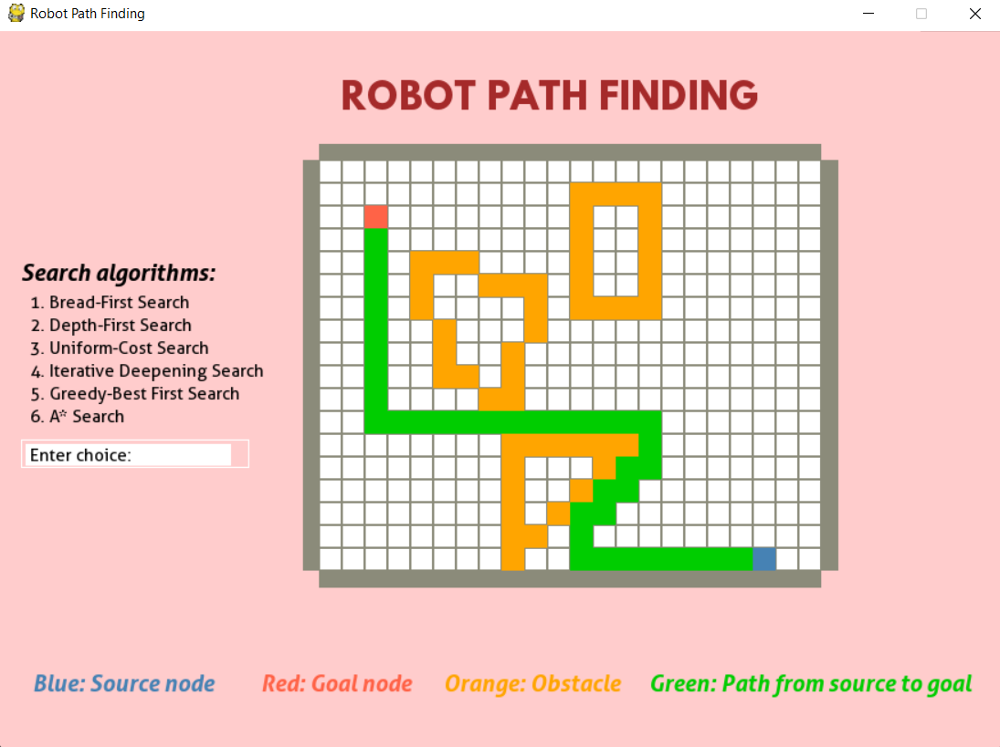

# Path-finding

### A pathfinding visualizer using Pygame to implement common searching algorithms such as Bread-First Search, Depth-First Search, A* Search,... 



## Setup and activate environment
```bash
pip install virtualenv
virtualenv venv
source venv/Scripts/activate
```

## Setup library
```bash
pip install -r requirements.txt
```
## Running the program
```bash
python main.py 
input file path: example/exp.txt
```
